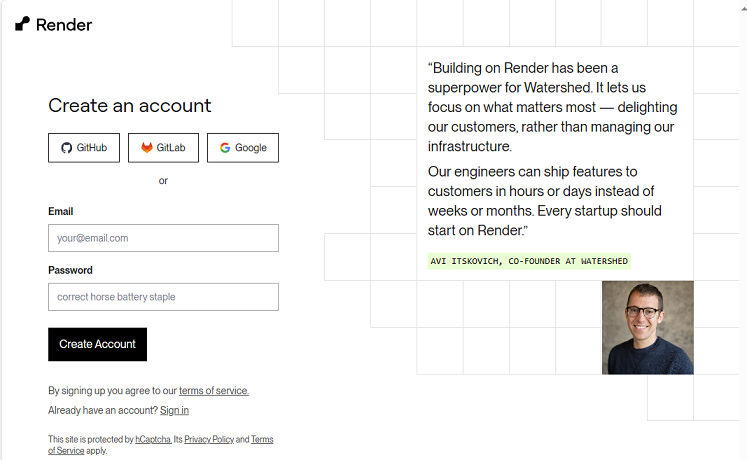
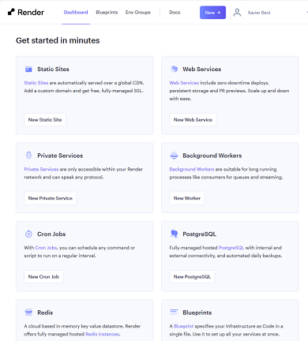
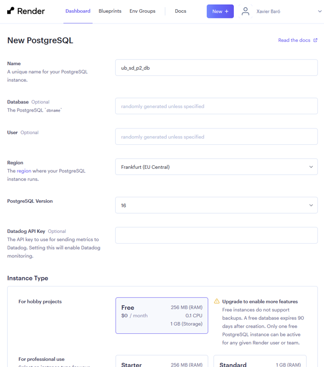

[](https://github.com/xbaro/template_fastapi_vue_fl0/actions/workflows/test.yml)
#  Pràctica 2 Sofware Distribuït

Aquesta plantilla és una simplificació d'una estructura "full-stack" que podeu trobar en aquest repositori:

https://github.com/tiangolo/full-stack-fastapi-template/tree/master

Teniu **l'enunciat i les guies** al repositori de l'enunciat associat a aquest codi inicial:

https://github.com/SoftwareDistribuitUB-2024/Enunciat_P2

En el projecte es defineixen dues aplicacions diferents, el backend i el frontend. 

***
El **backend (servidor)** fa referència a la part d'una aplicació que no és visible als usuaris. Entre les seves funciona habituals hi ha:  
* La lògica de negoci: Implementa les regles i processos vinculats a l'aplicació.
* Base de dades: Guarda i gestiona les dades de l'aplicació.
* Seguretat: Implementa les polítiques d'accés a l'aplicació a les seves dades, gestionant l'autenticació i autorització d'usuaris.
* Processa les sol·licituds (API): Gestiona les sol·licituds del frontend.

El **frontend (client)** s'ocupa principalment de la interacció amb l'usuari. Principalment s'encarrega de:
* Disseny de pàgines: Organització visual de la informació i la seva navegació.
* Botons i formular: Elementos interactius amb els que l'usuari pot interactuar.
* Continguts Visuals: Imàtges, vídeos i texto.
***

A continuació veurem com podem desplegar el projecte i començar a implementar les funcionalitats requerides.

# 1. Primers passos
## 1.1. Backend

### 1.1.1. Instal·lació de les dependències del backend
Utilitzarem [Poetry](https://python-poetry.org/) com a configurador del nostre projecte. 
Aquest configurador ens permet definir les propietats bàsiques del projecte i les seves dependències.

La definició del projecte es troba en el fitxer [pyproject.toml](./backend/pyproject.toml). 
Si el reviseu, veureu que inclou tant informació del projecte (nom, versió, etc.), 
com la llista de dependències que necessita.

El primer que necessitarem és instal·lar Poetry. Podeu seguir les instruccions actualitzades que trobareu a la seva [documentació](https://python-poetry.org/docs/#installation), o utilitzar l'instal·lador manual:

**Linux, macOS, Windows (WSL)**
```bash
curl -sSL https://install.python-poetry.org | python3 -
```
**Windows (PowerShell)**
```PowerShell
curl -sSL (Invoke-WebRequest -Uri https://install.python-poetry.org -UseBasicParsing).Content | py -
```

Podem verificar que la instal·lació ha anat correctament executant:
```bash
poetry --version
```

El que us hauria de mostrar la versió actual: ```Poetry (version 1.8.2)```. 
Ara ja podem crear un entorn virtual amb tot el que el nostre projecte necessita.
Per fer-ho, ens movem al directori del backend i executem:
```bash
poetry install
```
Si ja hem instal·lat les dependències, però hem hagut d'afegir-me alguna, podem actualitzar l'entorn utilitzant:
```bash
poetry update
```
Ara podem veure tota la informació sobre el nostre entorn virtual amb:
```bash
poetry env info
```
obrir un intèrpret de Python dins aquest entorn:
```bash
poetry shell
```
activar l'entorn perquè sigui el nostre per defecte:
```bash
poetry env use
```
o executar qualsevol comanda dins de l'entorn:
```bash
poetry run <comanda>
```

***
**Nota:** Molts IDEs com PyCharm o Visual Studio Code permeten la integració directa amb Poetry. Consulteu la documentació del vostre IDE.
***

### 1.1.2. Configuració del backend
La configuració de la nostra aplicació la farem via un fitxer d'entorn ```.env```. 
Aquest fitxer contindrà informació confidencial, com ara contrasenyes, per la qual cosa cal assegurar que
no es guarda al repositori de codi (GitHub). Podeu comprovar que el fitxer ```.gitignore``` conté
una línia amb aquest fitxer, fent que s'ignori.

Crea un nou fitxer a l'arrel del projecte amb el nom ```.env```, i afegeixi el següent contingut (substituint les XXX amb els valors que consideris):
```dotenv
# Nom de l'aplicació
PROJECT_NAME=sd_app
# Dades de l'administrador per defecte
FIRST_SUPERUSER=XXXX
FIRST_SUPERUSER_PASSWORD=XXXX
```

### 1.1.3. Creació de la base de dades
La base de dades utilitzada per a desenvolupament serà [SQLite](https://www.sqlite.org/).
Aquest sistema de bases de dades té com a peculiaritat que només necessita un fitxer i és molt lleuger.
Els models de la nostra aplicació estàn definits en el paquet de python **app.models** del backend. Utilitzarem
un sistema de gestió de migracions anomenat [Alembic](https://alembic.sqlalchemy.org/), que ens permetrà actualitzar la base de dades a mesura que
el nostre projecte avanci i el model canvïi.

Tenim ja creada la primera migració, corresponent al model actual. Per aplicar-la a la base de dades, caldrà executar:
```bash
alembic upgrade head
```

Si tot ha anat bé, s'haurà creat un fitxer ```sd_db.sqlite```, que conté la nostra base de dades.

### 1.1.4. Aixecar el backend
Ha arribat l'hora d'aixecar el backend. Per fer-ho, cal executar la comanda:

```bash
poetry run uvicorn app.main:app
```

Si estem fent canvis, podem afegir el paràmetre ```--reload``` per tal que s'apliquin automàticament els canvis que fem al codi:

```bash
poetry run uvicorn app.main:app --reload
```
Addicionalment, podem seleccionar un port diferent afegint ```--port #port``` o fer que escolti a connexions d'altres màquines amb ```--host 0.0.0.0```.

### 1.1.4. Accés a la documentació de l'API
El backend defineix una API, la qual permetrà que el frontend interactui amb l'aplicació. Un cop aixecat el backend, podem veure 
les funcionalitats de l'API visitant l'adreça [http://127.0.0.1:8000/docs](http://127.0.0.1:8000/docs).


## 1.2. Frontend

Pel que fa al frontend, utilitzarem el framework [Vue](https://vuejs.org/), un framework progressiu per construir interfícies 
d'usuari, és a dir, al costat del client. Tot i que Vue és més senzill que React o Angular, és
extremadament potent i es pot utilitzar per crear aplicacions avançades i
ofereix la creació de projectes de manera estructurada. 

Consisteix en un conjunt de biblioteques opcionals i biblioteques de tercers, i compta amb una
comunitat en creixement, convertint-se en una opció molt popular.

### 1.2.1 Instal·lació de npm

Per tal d'instal·lar i gestionar Vue, utilitzarem l'eina de comandes del repositori [npm](https://www.npmjs.com/).
Aquesta eina forma part de la instal·lació de [NodeJS](https://nodejs.org/en) i, per tant, el primer pas serà instal·lar aquest entorn.
Navegueu fins a la [pàgina de descàrregues](https://nodejs.org/en/download) i sel·leccioneu la més apropiada al vostre entorn.
En el cas de linux, podeu instal·lar les dues eines amb el gestor de paquests:

```bash
sudo apt install nodejs
sudo apt install npm
```

Comproveu que s'ha instal·lat les dues eines correctament utilitzant:

```bash
node --version
npm --version
```
    
En cas que estigueu a Linux, és possible que hagueu d'instal·lar Node Version Manager (NVM).
Aquest us permetrà triar una versió de node específica. Per instal·lar-lo, podeu seguir aquesta guia:
<https://phoenixnap.com/kb/install-latest-node-js-and-nmp-on-ubuntu>. 

### 1.2.2 Instal·lació de Vue

Un cop tenim correctament instal·lada l'eina npm, l'utilitzrem per instal·lar Vue. 
En aquest cas l'instal·larem a través de Vue CLI:

```bash
npm install -g @vue/cli
npm install -g @vue/cli-init
```
    
Per obtenir més assistència, consulteu la següent guia d'instal·lació:
<https://cli.vuejs.org/guide/installation.html>. 
Després de la instal·lació, comproveu que ha queat ben instal·lat:

```bash
vue --version
```

### 1.2.3 Crear i configurar un entorn de projecte

Primer de tot, aneu a la carpeta desitjada on voleu guardar el projecte. Després d'això, executeu a la línia d'ordres

```bash
vue init webpack frontend
```
Seleccioneu la configuració tal com es mostra a imatge següent:


Podeu interactuar amb les fletxes, les tecles d'entrada i l'espai.
Un cop creat el projecte, parem atenció als fitxers principals. La carpeta ```/src``` té la següent estructura:


- **App.vue**: s'encarrega de representar els components
- **assets**: on deseu tots els recursos, com ara imatges
- **components**: tots els components dels projectes. Tots els components tenen la seva pròpia plantilla html i codi JavaScript
- **main.js**: inicialitza i configura l'aplicació Vue
- **index.js**: enruta els components del vostre projecte
- **config**: conté la configuració de l'aplicació per a cada entorn

### 1.2.4. Executar el frontend

Per executar el frontend em mode desenvolupament (dev), entra a la carpeta **frontend** i executa la comanda:

```bash
npm run dev
```
Després d'executar aquestes línies d'ordres, obriu l'URL <http://localhost:8080/> al navegador.

També teniu una eina visual per a treballar amb els desplegaments i interactuar amb el projecte. Per obrir-la,
executeu:

```bash
vue ui
```

i navegueu a l'URL <http://localhost:8000/>.

### 1.2.5. Compilar el frontend

Per generar els fitxers del frontend per a la seva distribució caldrà compilar-los. Per fer-ho, 
executeu:

```bash
npm run build
```


```bash
python3 -m http.server
```


# 2. Documentació

Per generar la memòria del lliurament de la pràctica, utilitzarem un entorn de generació de documentació basat en markdown.
En el directori ```docs``` del repositori trobareu el següent:

* Un fitxer ```book.toml``` amb la configuració principal de la documentació. Modifiqueu l'autor i la informació que considereu.
* Una carpeta ```src``` amb els fitxers de la documentació.

Dins el directori de codi ```src``` hi ha un fitxer **SUMMARY.md** que conté l'índex de la documentació, i enllaça els diferents fitxers amb la resta d'apartats.
Podeu trobar més informació a la documentació del framework [mdBook](https://rust-lang.github.io/mdBook/index.html).

## 2.1 Generació de la documentació

**Producció**

La documentació es genera automàticament cada cop que actualitzeu el codi a la branca principal, i queda guardada al pròpi GitHub.
Utilitzem [GitHub Pages](https://pages.github.com/). Cal tenir activat l'ús de Pages a la configuració del repositori, on 
també trobareu l'URL a la qual podeu accedir al document generat.

**Desenvolupament**

Podeu previsualitzar l'estructura de la documentació seguint els següents passos:

1. Descarregueu l'executable per al vostre sistema del [repositori de mdBook](https://github.com/rust-lang/mdBook/releases).
2. Des de l'arrel del repositori, executeu ```mdbook serve docs``` i accedir a la previsualització accedint a <http://localhost:3000>.
3. Des de l'arrel del repositori, executeu ```mdbook build docs``` i es generarà la versió html de la documentació.

# 3. Desplegament a producció

Generalment en el desenvolupament d'aplicacions informàtiques es defineixen diferents entorns, que ajuden a assegurar la qualitat
del software. Dos dels entorns que no poden faltar són el de **desenvolupament** i **producció**. El de desenvolupament
està pensat perquè reflecteixi de forma ràpida els canvis en el codi, agilitzant la tasca dels desenvolupadors i facilitant la depuració del codi.
La de producció pel contrari, acostuma a incorporar optimitzacions del codi per minimitzar-ne la mida i maximitzar-ne el rendiment.

Els desplegaments que hem vist del backend a la secció [1.1.4](#1.1.4.-Aixecar-el-backend) i del frontend a la secció [1.2.4](#1.2.4.-Executar-el-frontend),
correspondrien a l'entorn de **desenvolupament**.

L'entorn de **producció** es desplegarà cada vegada que actualitzem el contingut de la **branca principal** del repositori. En l'actualitat, el més habitual és
utilitzar un entorn cloud (com Amazon Web Services o Microsoft Azure) en comptes de servidors físics. En el nostre cas utilitzarem la plataforma cloud [render.com](https://render.com/),
que ens permet fer el desplegament d'aplicacions petites de forma gratuïta.

## 3.1 Crear un compte d'usuari

El primer pas serà donar-nos d'alta a [render.com](https://render.com/). Podem crear el compte directament a partir del nostre compte de GitHub.



Un cop tinguem un compte, podem veure la llista de serveis que ens ofereix la plataforma:



Els que ens interessaran en el nostre cas seran:
- **PostreSQL:** Ens permetrà crear una base de dades al núvol.
- **Web Services:** Ens permetrà desplegar el backend al núvol.
- **Static Sites:** Ens permetrà desplegar el frontend al núvol.

Cal ser conscients que en utilitzar el servei gratuit, tindrem una sèrie de limitacions en tot el que despleguem,
com l'espai que podem utilitzar, el trànsit d'usuaris o els temps de resposta, que seràn més grans que en un desplegament
de pagament. En cas d'innactivitat, el sistema quedarà aturat, i per tant la primera vegada que vulguem tornar a utilitzar-lo 
ens trigarà considerablement (aproximadament 1-2 minuts).

## 3.2 Crear una base de dades

Sel·leccionarem el servei PostgreSQL i demanarem crear una nova base de dades. 




